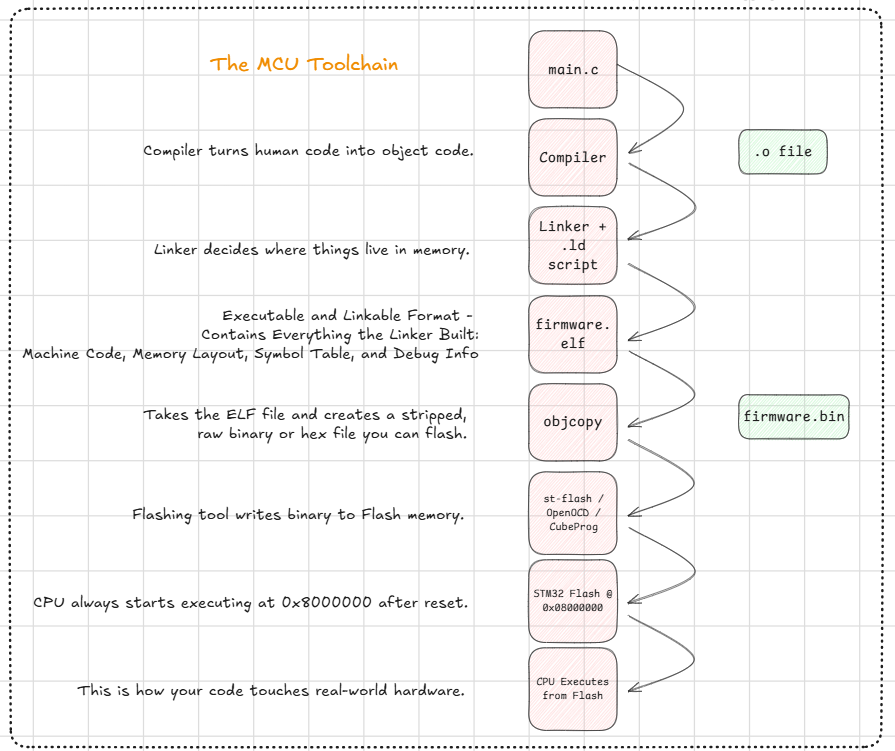
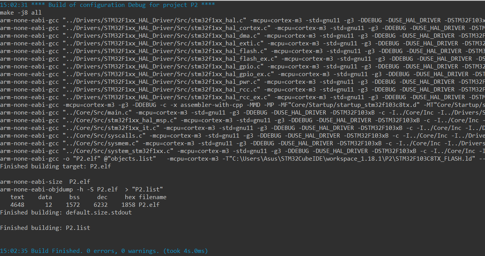

<h3>Navigation Menu</h3>
<ul>
 <li><a href="Learning%20Outcomes.md">Learning Outcomes</a></li>
 <li><a href="P1_WhatIsBareMetalProgramming.md">P1_WhatIsBareMetalProgramming</a></li>
 <li><a href="P2_AnatomyOfAMicrocontroller.md">P2_AnatomyOfAMicrocontroller</a></li>
 <li><a href="P3_Registers&MemoryMap.md">P3_Registers&MemoryMap</a></li>
 <li><a href="P4_Datasheets&RefManuals.md">P4_Datasheets&RefManuals</a></li> 
 <li><a href="CodeExamples.md">CodeExamples</a></li>
</ul>

---
# PART 5: Toolchain Overview: From Code to Microcontroller

Bare-metal programming requires a toolchain that transforms your C/C++ source code into machine code and deploys it to your microcontroller. This section gives a structured overview of each part in the pipeline.



---
## What Is a Toolchain?

A toolchain is a set of programs that work together to:

- Compile code (`.c` / `.cpp` → `.o`)
- Link object files and libraries into an executable (`.elf`)
- Convert the executable into a binary (`.bin` / `.hex`)
- Flash the binary to your microcontroller
- Debug the program in real-time

---

## Components of a Typical Toolchain

### 1. Compiler

Converts human-readable code into machine instructions.

**Popular choices:**
- **GCC (GNU Arm Embedded Toolchain):** Free, widely supported
- **Keil MDK (ARMCC):** Commercial, powerful IDE
- **IAR Embedded Workbench:** High-performance commercial compiler



---
### 2. Linker

Merges multiple object files (`.o`) and resolves addresses and memory layout using a linker script.

**Example Linker Script (STM32):**

```
MEMORY  
{  
	FLASH (rx) : ORIGIN = 0x08000000, LENGTH = 64K  
	RAM (rwx) : ORIGIN = 0x20000000, LENGTH = 20K  
}

SECTIONS  
{  
	.text : { _(.text_) } > FLASH  
	.data : { _(.data_) } > RAM  
}
```

---

### 3. Startup Code

Before `main()` runs, the MCU executes startup code that:

- Initializes stack and heap
- Sets up interrupt vector table
- Initializes global/static variables

**Example: `startup_stm32f1xx.s` (Assembly)**

```
Reset_Handler:  
LDR R0, =_estack  
MOV SP, R0  
BL SystemInit  
BL main
```

Startup Sequence:

```
Power-on/Reset
   ↓
Sample BOOT0/BOOT1 pins
   ↓
Select boot memory (Flash, system memory, SRAM)
   ↓
Fetch Stack Pointer and Reset Handler from vector table
   ↓
Run startup code (initialize memory, hardware)
   ↓
Call main()
```


---
### 4. Flashing Tools

Once you’ve compiled your program, you need to flash it to your microcontroller.

| Tool                                | Description                              |
|--------------------------------------|------------------------------------------|
| ST-Link Utility / STM32CubeProgrammer| Official ST flashing tools               |
| OpenOCD                             | Open-source flashing/debug tool          |
| dfu-util                            | For USB bootloaders (DFU mode)           |
| pyocd                               | Python-based flasher/debugger            |

### Example (using OpenOCD + ST-Link):

```
openocd -f interface/stlink.cfg -f target/stm32f1x.cfg
```

Then, in a separate terminal:

```
telnet localhost 4444

> reset halt  
> flash write_image erase myprogram.elf  
> reset run
```

---
### 5. Debugger

This lets you pause execution, inspect registers, set breakpoints, and step through your code.

**Popular options:**
- GDB (via OpenOCD or pyocd)
- Segger Ozone (for J-Link)
- Keil / IAR IDEs with GUI debuggers

**Example: Running GDB:**

```
arm-none-eabi-gdb myprogram.elf  
target remote localhost:3333  
monitor reset halt  
break main  
continue
```

---
## IDEs and Build Systems

You can either use:

### Bare Toolchain + Makefile/CMake

**Pros:** Total control, transparency

**Tools:** VS Code + Makefile, CMake, custom scripts

**Example Makefile:**

```
CC=arm-none-eabi-gcc  
CFLAGS=-mcpu=cortex-m3 -mthumb -Wall

all: main.elf

main.elf: main.o startup.o  
$(CC) $(CFLAGS) -T linker.ld -o $@ $^
```

### Smart IDEs

| IDE                     | Features                                   |
|-------------------------|--------------------------------------------|
| STM32CubeIDE            | One-stop IDE with ST tools built-in        |
| Keil uVision            | Commercial, mature, GUI debugging          |
| PlatformIO              | Cross-platform embedded dev in VS Code     |
| Segger Embedded Studio  | Lightweight IDE for J-Link users           |

**In the upcoming sections, we will stick with the STM32CubeIDE.

## Summary

| Component        | Role                             |
| ---------------- | -------------------------------- |
| Compiler         | Converts source to machine code  |
| Linker           | Combines files & maps memory     |
| Startup Code     | Prepares the system for `main()` |
| Flash Tool       | Uploads your binary to the MCU   |
| Debugger         | Lets you inspect and test code   |
| IDE/Build System | Automates the workflow           |

---
